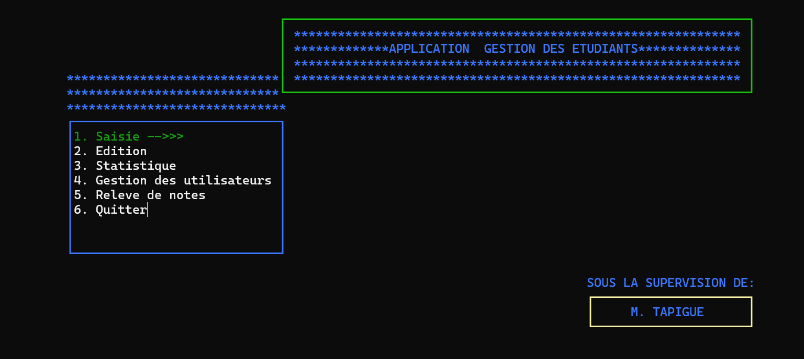
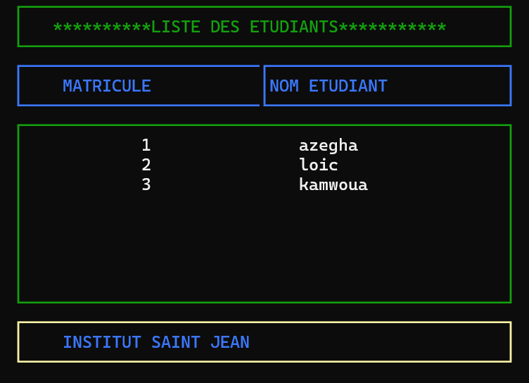
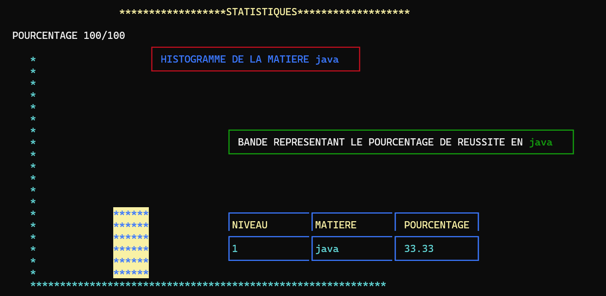
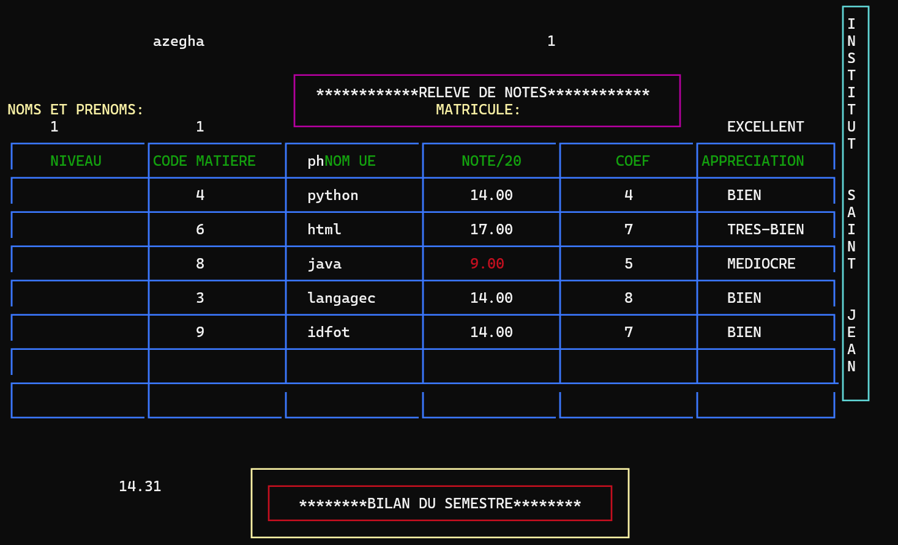
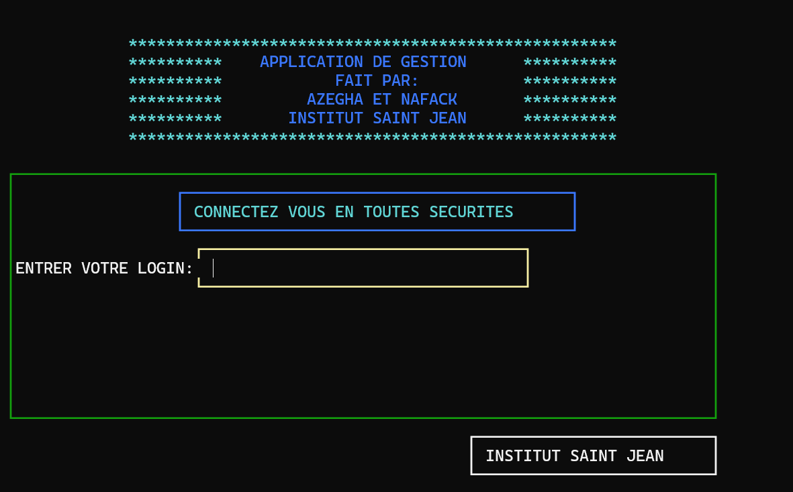

# 📚 Application de Gestion Universitaire

Bienvenue dans l'Application de Gestion Universitaire, réalisée pour l'Institut Universitaire Saint Jean! 🚀

---

## 📝 Présentation

Cette application de gestion étudiante offre une suite complète de fonctionnalités pour gérer efficacement les étudiants, les matières et les notes au sein de l'Institut Universitaire Saint Jean. Elle est conçue pour les administrateurs académiques, leur permettant de maintenir un système organisé et automatisé pour une gestion académique transparente.

---

## 🔍 Fonctionnalités Principales

### 1. Saisie 📥
- **Ajout Étudiant**: Permet d'enregistrer les informations détaillées des étudiants.
- **Ajout Matière**: Ajoutez de nouvelles matières avec facilité.
- **Saisie de Notes**: Enregistrez les notes des étudiants dans une matière spécifique.
- 

### 2. Consultation✏️

- **Liste d'un Niveau**: Visualisez les étudiants d'un niveau spécifique.
- **Liste des Matières**: Accédez à une liste complète des matières enregistrées.

### 3. Statistiques 📊
- **Pourcentage de Réussite**: Calculez le pourcentage de réussite d'une matière dans un niveau donné.
- **Meilleur Étudiant**: Identifiez le meilleur étudiant de chaque niveau.
- **Étudiant le Plus Faible**: Trouvez l'étudiant avec le score le plus bas dans un niveau.
- 

### 4. Gestion des Utilisateurs 👥
- **Créer un Nouveau Compte**: Créez et gérez des comptes utilisateurs sécurisés.
- **Accès au Compte**: Connectez-vous avec un identifiant et mot de passe pour accéder à votre compte.

### 5. Relevé de Notes 📋
- **Relevé Académique**: Génération et affichage de relevés de notes complets pour les étudiants sur la base de leur matricule.
- 

### 6. Sécurité et Connexion 🔐
- **Connexion Sécurisée**: Accédez à l'application en toute sécurité avec des identifiants et mots de passe vérifiés.
- 

---

## 📂 Structure

L'application est organisée de manière à assurer une fluidité d'utilisation et une navigation intuitive à travers les différentes fonctionnalités. Elle utilise des cadres visuels et un design interactif pour une expérience utilisateur enrichie.

---

## 🎯 Utilisation

Lors de votre première connexion, entrez votre identifiant et mot de passe. Si vous êtes un nouvel utilisateur, vous pouvez créer un compte directement depuis l'application.

Utilisez les options de menu déroulant pour accéder aux fonctionnalités spécifiques de gestion académique.

--- 

## 🛠️ Technologies Utilisées

- **Langage de programmation**: C
- **Bibliothèques standard**: `stdio.h`, `string.h`, `conio.h`
- **Modules personnalisés**: `cadreenc.h`, `entetemenuderoulant.h`, `saisiefunc.h`

---

## 📬 Contact

Pour toute question ou assistance concernant l'application, veuillez me contacter à l'adresse : loicanicetazegha@gmail.com.

Ce projet a été réalisé en 2022 pour l'Institut Universitaire Saint Jean. J'espère qu'il facilitera vos tâches administratives académiques et contribuera au succès de votre institution ! 🎉

---

Merci d'utiliser l'Application de Gestion Universitaire! 📚🎓
